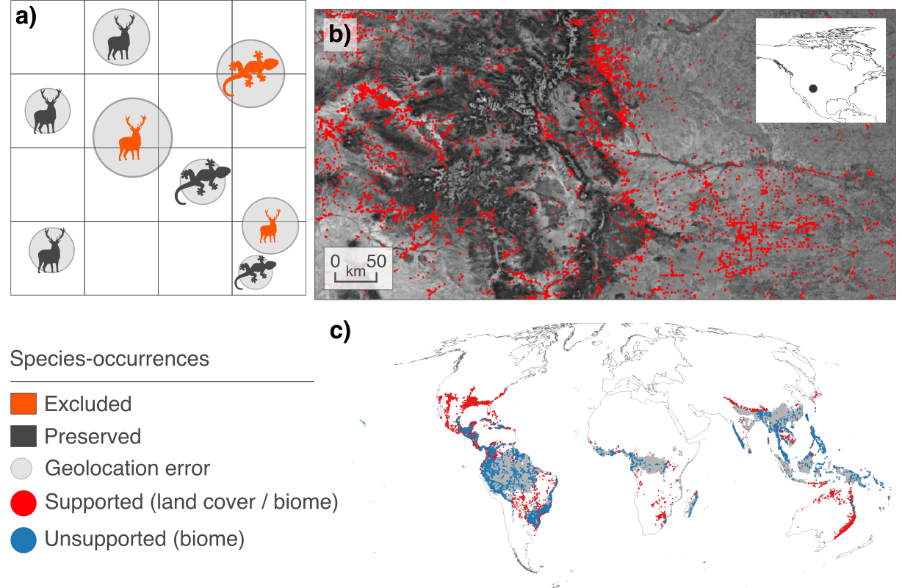

<p align="center">
  
</p>

## 1. A general framework for generating reference data for ecosystem mapping
<p align="justify">
  Losses of ecosystem extents threaten biodiversity and people. Ecosystem monitoring and conservation in accordance with the Kunming-Montreal Global Biodiversity Framework (GBF) require accurate, regularly updated maps of ecosystem extent. Yet, quality-vetted reference data on ecosystem occurrences required for training and validation of maps remain scarce, non-standardized, and largely inaccessible. In contrast, billions of species-occurrence records are being shared through the Global Biodiversity Information Facility (GBIF). Here, in response to the <a href="https://www.gbif.org/news/3DyM3tK5wgYipqyaHwG2c2/2026-ebbe-nielsen-challenge-open-for-submissions">Ebbe Nielsen challenge of 2026</a>, we present a framework that mobilizes GBIF for generating ‘mapping-grade’ reference data, i.e., data that are of sufficient quality for supporting ecological mapping applications.
</p>

### 1.1. How do the concepts of *species*, *habitat*, and *ecosystem* relate? :jigsaw:
<p align="justify">
  Species are associated with habitats, while ecosystems describe the broader biotic and abiotic systems in which these habitats occur. Because many species occupy only a limited range of habitats, species observations can provide indirect evidence for the occurrence of particular ecosystem types. By combining species-occurrence records with standardized information on species' habitat associations, GBIF data can therefore be mobilized for ecosystem mapping applications. We building on this concept, providing  
</p>

### 1.2. Translating *species* into *ecosystems* requires careful data quality controls :warning:
<p align="justify">
  Simply assigning ecosystems based on habitat associations is insufficient for mapping applications. Ecosystem mapping requires reference data that are aligned with the target mapping resolution and classification scheme, accurately labeled, and with explicit uncertainty characterization, consistent with current good practices in map validation <a href="https://lpvs.gsfc.nasa.gov/documents.html">(Tyukavina et al., 2025)<a/>. Opportunistic species observations are affected by multiple sources of uncertainty, including positional uncertainties, spatial misalignments with mapping units, labeling uncertainty, disagreements among experts regarding species-habitat associations, and species vagrancy beyond documented habitat preferences.
</p>

</br>

  <p align="center">
    
  </p>
<p align="justify">
  <sub><b>Figure 1. Data issues in translating species occurrences into ecosystems</b>. <b>a)</b> Species occurrences relative to the target mapping grid. The geolocation uncertainty (in grey) creates doubts regarding the class represented by the corresponding species occurrence (in red). <b>b)</b> Occurrence records for a temperate-forest specialist in the Southern Rocky Mountains with observations outside forest areas. <b>c)</b> Occurrences of species specialized in sub-/tropical lowland moist forests overlap with the corresponding biome (in grey, observations in blue), with some extending to savanna regions and temperate rainforests (in red).</sub>
</p>

</br>

### 1.3. How does our framework addresses these issues? :hammer_and_wrench:


In the following section, we guide you through the use of our framework to resolve these issues, supported by practical examples.   

## 2. Setup 🔄
To better ilustrate the application of our framework and its functionalities, we will do as following:
  1. Install the R package <i></i>sp2eco</p>i>, the engine of our framework, and
  2. Obtain needed auxiliary data

The code below performs these steps for you. The only thing you require is to change *working_directory* to a location in your system. Note that the code downloads a file zip-file from Zenodo. This file contains a standardized folder structure that includes example data and a vigette with a practical example that is deployed automatically. 

```r
# Install prerequisites if needed
if (!requireNamespace("remotes", quietly = TRUE)) install.packages("remotes")

# Install package along with the reproducible vignette
remotes::install_github("your-username/your-repo-name", build_vignettes = TRUE)
```

## How does our framework support GBIF and its mission?
Our framework addresses all priority areas of GBIF’s 2023-2027 Strategic Framework:
- Rather than serving solely as evidence of species occurrence, GBIF occurrence records become standardized evidence of ecosystem occurrences, opening completely new applications in ecosystem mapping, Earth Observation, ecosystem accounting, and biodiversity monitoring (<b>Priority Area 1</b>)
- By enabling the production of mapping-grade ecosystem reference data, it addresses a critical bottleneck for monitoring ecosystem extent under the Kunming-Montreal Global Biodiversity Framework and SEEA-EA. In doing so, it strengthens GBIF’s relevance to environmental reporting, natural capital accounting, and evidence-based decision-making, helping the platform target and engage with a wider range of stakeholders and supporting (<b>Priority Area 2</b>).
- The quality-control filters included in our workflow contribute to advancing data-quality standards, and the efficient identification and resolution of errors (<b>Priority Area 4</b>).

##  License 📄
This project is licensed under the [MIT / GPL-3] License - see the `LICENSE` file for details.
